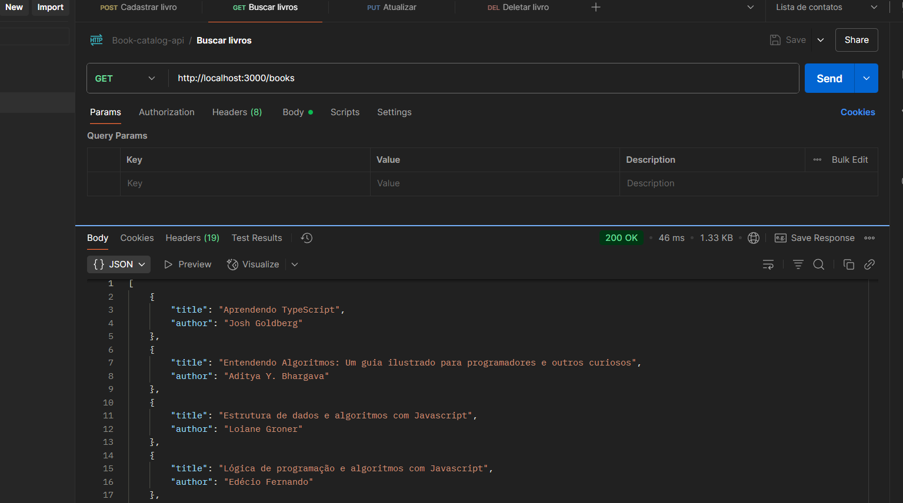
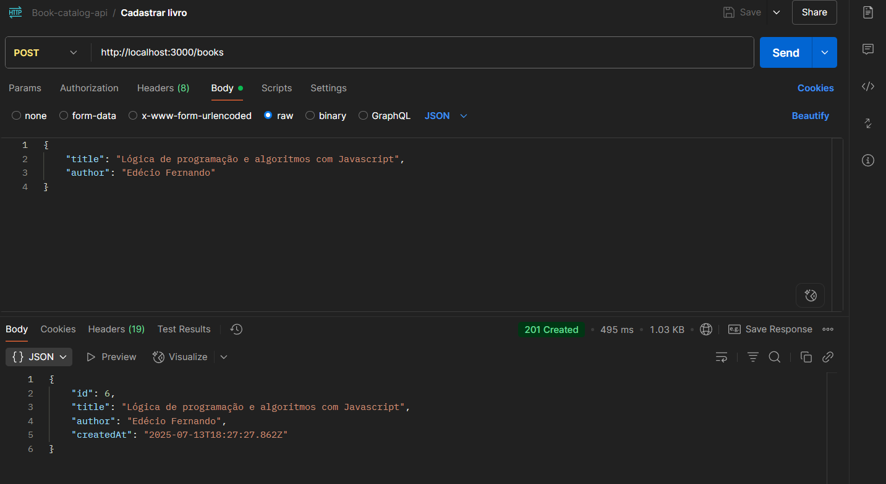
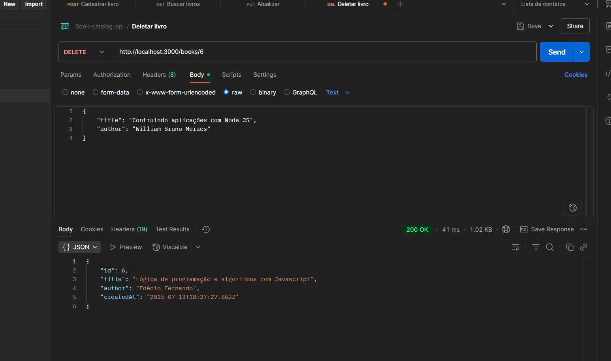

# 📚 Book Catalog API

API REST simples para cadastro, listagem, atualização e exclusão de livros.  
Feita em **Node.js**, **Express** e **Prisma**, usando banco de dados SQLite.

---

## ✅ Funcionalidades

-   Listar todos os livros
-   Cadastrar um novo livro
-   Atualizar um livro existente
-   Deletar um livro

---

## 🚀 Tecnologias usadas

-   Node.js
-   Express
-   Prisma ORM
-   MySQL
-   TypeScript

---

## ⚙️ Como rodar o projeto

1. **Clone o repositório:**

```bash
git clone https://github.com/seu-usuario/book-catalog-api.git
cd book-catalog-api
```

2. **Instale as dependências:**

```bash
npm install
```

3. **Configure o Prisma:**

```bash
npx prisma init
```

No arquivo `.env` que o Prisma cria, defina a variável `DATABASE_URL`:

```env
DATABASE_URL="file:./dev.db"
```

4. **Crie o banco e gere o client do Prisma:**

```bash
npx prisma migrate dev --name init
```

> Ou se preferir só criar sem migrations:  
> `npx prisma db push`

5. **Inicie o servidor:**

```bash
npm run dev
```

> O servidor vai rodar por padrão em `http://localhost:3000`.

---

## 📦 Estrutura de pastas

```bash
book-catalog-api/
├── node_modules/
├── prisma/
│   └── schema.prisma
├── src/
│   ├── routes/
│   │   └── books.ts
│   └── server.ts
├── package.json
└── tsconfig.json
```

---

## 📦 Rotas da API

Todas as rotas começam com `/books`.

### 🔍 Listar todos os livros

**GET** `/books`

Retorna um array de livros cadastrados.

```json
[
    {
        "title": "Dom Quixote",
        "author": "Miguel de Cervantes"
    }
]
```

---

### ➕ Cadastrar um novo livro

**POST** `/books`

Body (JSON):

```json
{
    "title": "Novo Livro",
    "author": "Nome do Autor"
}
```

Resposta (201):

```json
{
    "id": 1,
    "title": "Novo Livro",
    "author": "Nome do Autor"
}
```

---

### ✏️ Atualizar um livro

**PUT** `/books/:id`

Body (JSON):

```json
{
    "title": "Título atualizado",
    "author": "Autor atualizado"
}
```

---

### 🗑️ Deletar um livro

**DELETE** `/books/:id`

---

## 📄 Exemplo de requisições

Recomendo usar o [Postman](https://www.postman.com/) ou [Insomnia](https://insomnia.rest/) para testar.  
Você também pode criar um arquivo `books.http` ou exportar uma collection do Postman para incluir no repositório.

---

## 📸 Prints do Projeto

### 🧪 Testando a API no Postman



### ➕ Cadastro de novo livro



### 🗑️ Deleção de livro



---

## ✍️ Autor

Feito por [Cayo Fonseca](https://github.com/cayofonseca)
